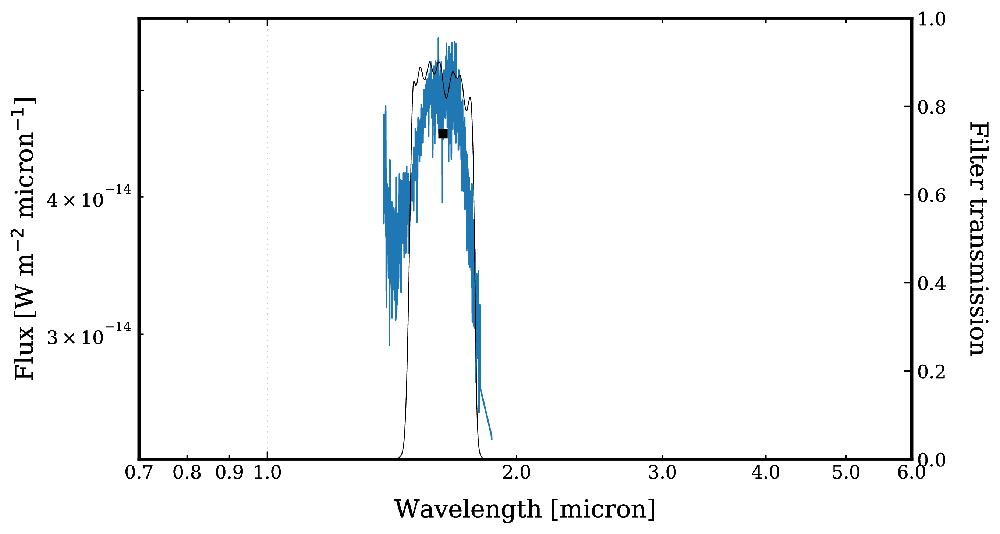
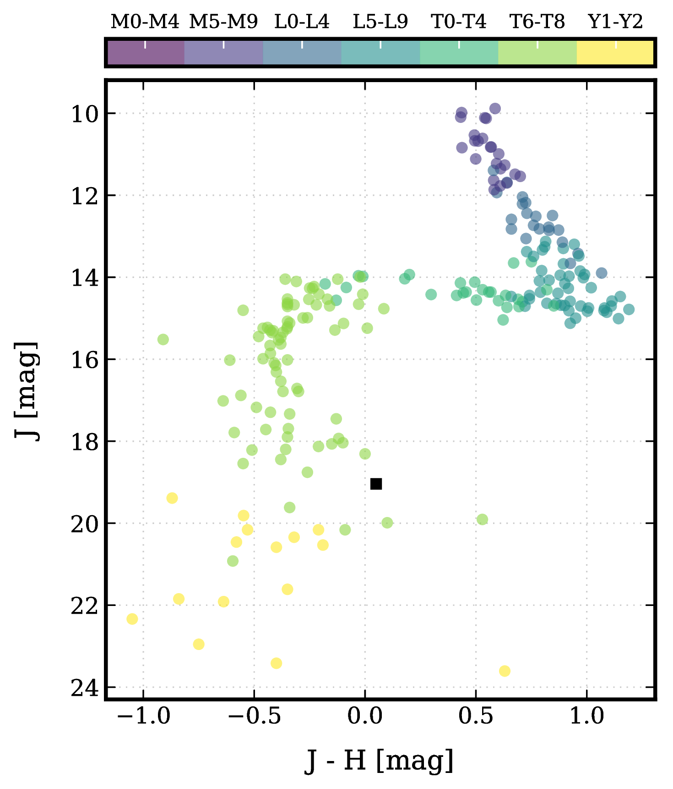
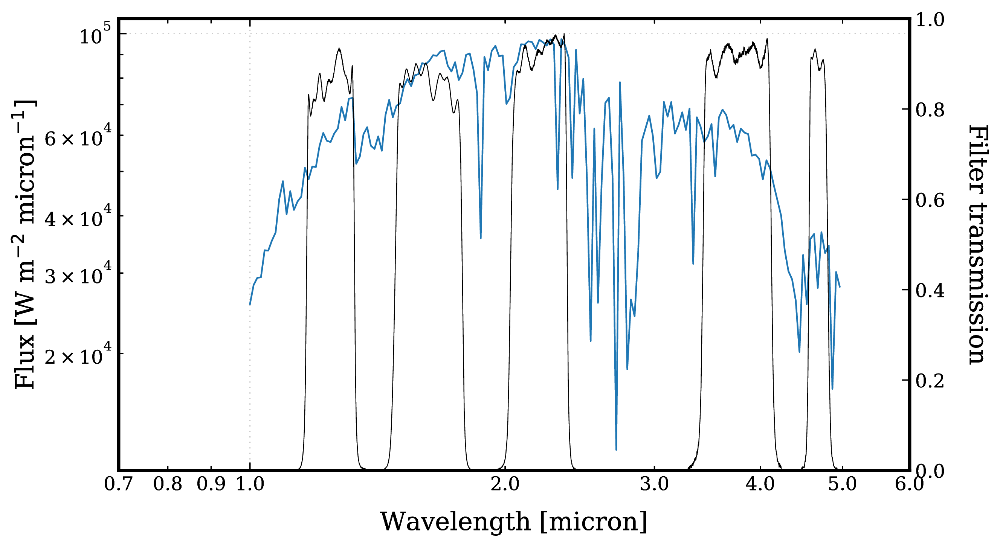
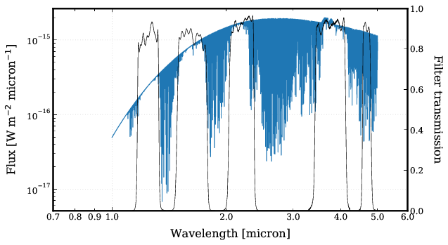

.. _examples:

Examples
========

Photometric calibration
-----------------------

Calculating the flux density for a given magnitude (and the other way around) is done in the following way::

   import species

   species.SpeciesInit("./", "./data")

   synphot = species.SyntheticPhotometry("MKO/NSFCam.J")
   flux, error = synphot.magnitude_to_flux(19.04, 0.40)
   app_mag, _ = synphot.flux_to_magnitude(flux, None)

L0 type spectrum
----------------

The following code will download the IRTF spectral library and added to the database. Synthetic photometry is then calculated for the first (L0 type) spectrum from the library at the MKO H filter. The spectrum slice is then plotted together with the filter profile and the photometry::

   import species

   species.SpeciesInit("./", "./data")

   spectrum = species.ReadSpectrum("irtf", "MKO/NSFCam.H")
   wavelength, flux_density = spectrum.get_spectrum()

   synphot = species.SyntheticPhotometry("MKO/NSFCam.H")
   phot = synphot.spectrum_to_photometry(wavelength[0, ], flux_density[0, ])

   transmission = species.ReadFilter("MKO/NSFCam.H")
   wl_mean = transmission.mean_wavelength()

   species.plot_spectrum(wavelength[0, ], flux_density[0, ], ("MKO/NSFCam.H", ), ((wl_mean, phot), ), "photometry.pdf")

Color-magnitude diagram
-----------------------

Here photometric data of 51 Eri b (Rajan et al. 2017) is added to the database. Then a color-magnitude diagram (J-H vs. J) is created from the IRTF spectral library and the data point of 51 Eri b is added to the plot (black square)::

   import species

   species.SpeciesInit("./", "./data")

   magnitudes = {"MKO/NSFCam.J":19.04, "MKO/NSFCam.H":18.99, "MKO/NSFCam.K":18.67, "Keck/NIRC2.Lp":16.20, "Keck/NIRC2.Mp":16.1}

   database = species.Database()
   database.add_object("51 Eri b", 29.43, magnitudes)

   object_cmd = (("51 Eri b", "MKO/NSFCam.J", "MKO/NSFCam.H", "MKO/NSFCam.J"), )

   colormag = species.ReadColorMagnitude(("MKO/NSFCam.J", "MKO/NSFCam.H"), "MKO/NSFCam.J")
   color, mag, sptype = colormag.get_color_magnitude("field")
   species.plot_color_magnitude(color, mag, sptype, object_cmd, "J - H [mag]", "J [mag]", "color_mag_j-h_j.pdf")

Atmospheric models
------------------

In the last example, the DRIFT-PHOENIX atmospheric models are added to the database. The grid is then interpolated and a spectrum for a given set of parameter values and spectral resolution is computed. The spectrum is then plotted together with several filter curves::

   import species

   species.SpeciesInit("./", "./data")

   filters = ("MKO/NSFCam.J", "MKO/NSFCam.H", "MKO/NSFCam.K", "MKO/NSFCam.Lp", "MKO/NSFCam.Mp")

   model = species.ReadModel("drift-phoenix", (1.0, 5.0))
   spectrum = model.get_model({'teff':1510., 'logg':4.1, 'feh':0.1}, 100.)
   species.plot_spectrum(spectrum[0], spectrum[1], filters, None, "drift-phoenix_filters.pdf")

Or, a spectrum with the original spectral resolution can be obtained from the (discrete) model grid::

   model = species.ReadModel("drift-phoenix", (1., 5.))
   spectrum = model.get_data({'teff':1200., 'logg':4.0, 'feh':0., 'radius':1., 'distance':10.})
   species.plot_spectrum(spectrum[0], spectrum[1], filters, None, "drift-phoenix_full.pdf")

