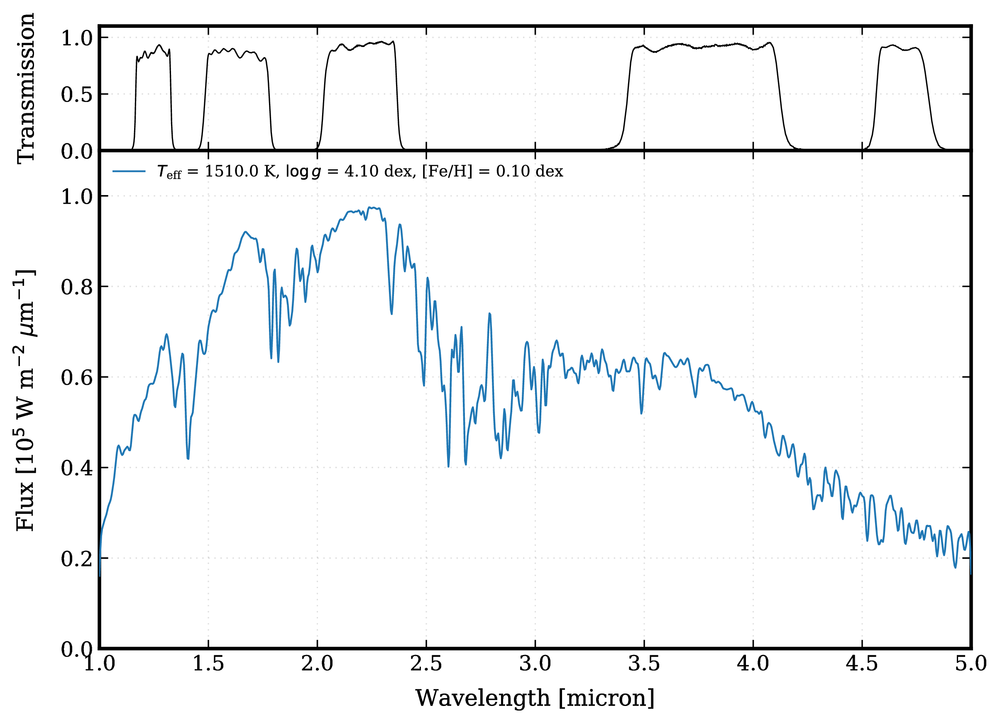
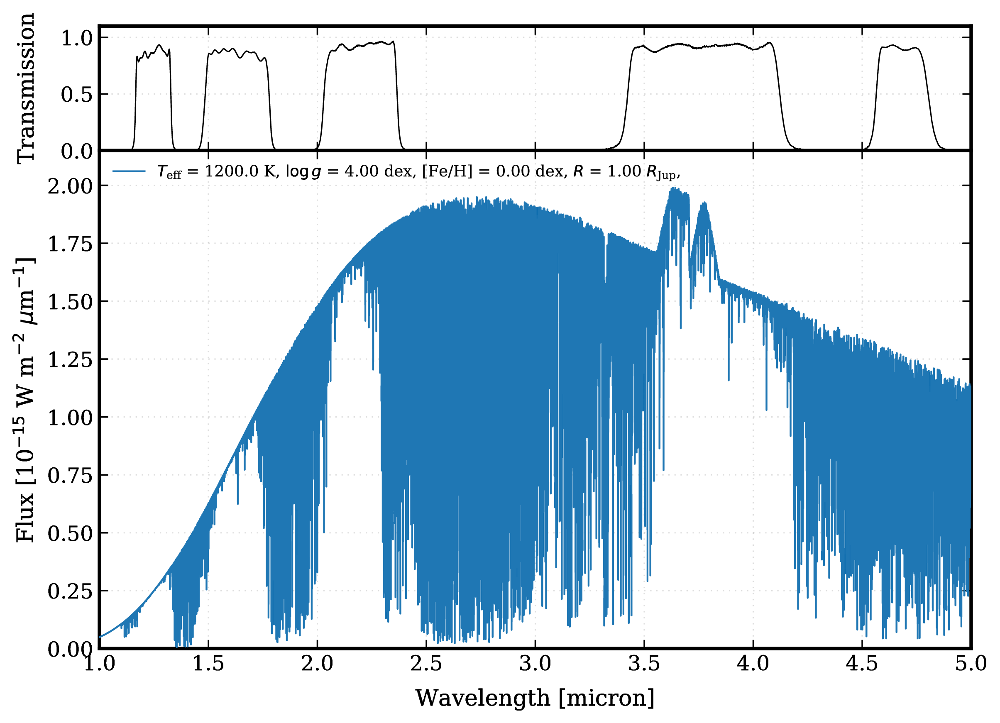
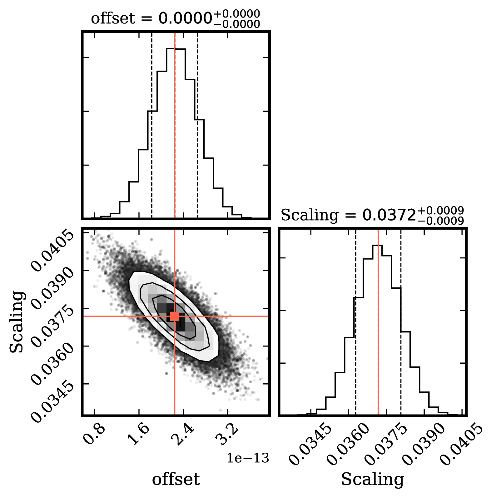
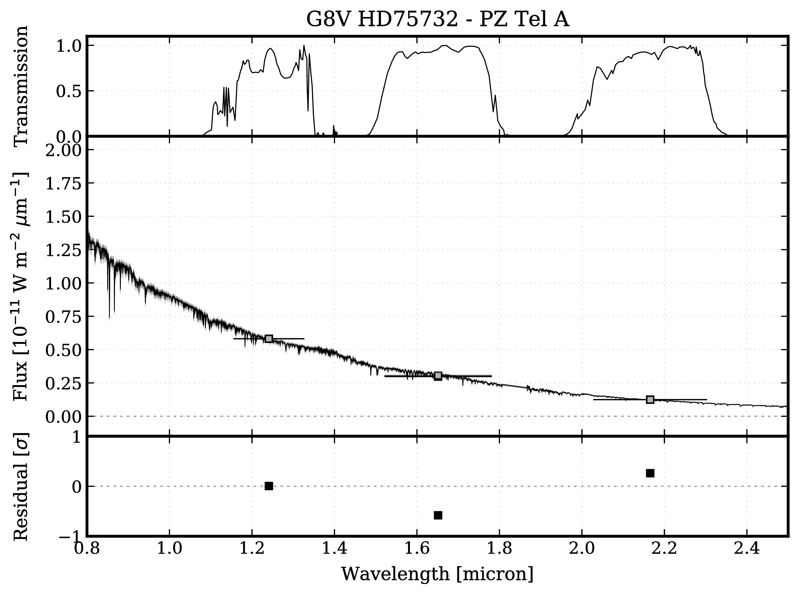

.. _examples:

Examples
========

Configuration file
------------------

A configuration file is required in the working folder. In this case, the configuration file is named *species_config.ini* and its content is::

   [species]
   database = species_database.hdf5
   config = species_config.ini
   input = data/

Conversion of photometry units
------------------------------

To calculated the flux density from a magnitude (and the other way around)::

   import species

   species.SpeciesInit("./")

   synphot = species.SyntheticPhotometry("MKO/NSFCam.J")

   flux, error = synphot.magnitude_to_flux(19.04, 0.40)
   app_mag, _ = synphot.flux_to_magnitude(flux, None)

   print("Apparent flux density [W m-2 micron-1] =", flux)
   print("Apparent magnitude [mag] =", app_mag)

Synthetic photometry
--------------------

To calculate synthetic photometry from a Planck function for given filter::

   import species

   species.SpeciesInit('./')

   box = species.get_planck(temperature=200.,
                            radius=1.0,
                            distance=20.,
                            wavelength=(1.0, 30.),
                            specres=1000.)

   synphot = species.SyntheticPhotometry('JWST/MIRI.F1000W')

   phot = synphot.spectrum_to_photometry(box.wavelength, box.flux)
   mag = synphot.spectrum_to_magnitude(box.wavelength, box.flux)

   print('Apparent flux density [W m-2 micron-1] =', phot)
   print('Apparent magnitude [mag] =', mag[0])

Spectral library
----------------

The following code will download the IRTF spectral library and add the spectra to the database. An L0 type spectrum is then read from the database and synthetic photometry is computed for the MKO H filter. The spectrum slice is plotted together with the filter profile and the synthetic photometry::

   import species

   species.SpeciesInit('./')

   spectrum = species.ReadSpectrum(spectrum='irtf', filter_name='MKO/NSFCam.H')
   specbox = spectrum.get_spectrum(sptype='L0')

   synphot = species.SyntheticPhotometry(filter_name='MKO/NSFCam.H')

   phot = synphot.spectrum_to_photometry(wavelength=specbox.wavelength,
                                         flux_density=specbox.flux)

   transmission = species.ReadFilter(filter_name='MKO/NSFCam.H')
   wl_mean = transmission.mean_wavelength()

   photbox = species.create_box(boxtype='photometry',
                                name='L0 dwarf',
                                wavelength=wl_mean,
                                flux=phot)

   species.plot_spectrum(boxes=(specbox, photbox),
                         filters=('MKO/NSFCam.H', ),
                         output='photometry.pdf',
                         xlim=(1., 2.5),
                         offset=(-0.08, -0.06))

.. image:: _images/photometry.png
   :width: 80%
   :align: center

Color-magnitude diagram
-----------------------

Here photometric data of 51 Eri b (Rajan et al. 2017) is added to the database. Then a color-magnitude diagram (J-H vs. J) is created from the IRTF spectral library and the data point of 51 Eri b is added to the plot (black square)::

   import species

   species.SpeciesInit('./')

   database = species.Database()
   database.add_companion(name=None)

   object1 = ('beta Pic b', 'Paranal/NACO.J', 'Paranal/NACO.H', 'Paranal/NACO.J')
   object2 = ('51 Eri b', 'MKO/NSFCam.J', 'MKO/NSFCam.H', 'MKO/NSFCam.J')

   colormag = species.ReadColorMagnitude(library=('vlm-plx', ),
                                         filters_color=('MKO/NSFCam.J', 'MKO/NSFCam.H'),
                                         filter_mag='MKO/NSFCam.J')

   colorbox = colormag.get_color_magnitude(object_type='field')

   species.plot_color_magnitude(colorbox=colorbox,
                                objects=(object1, object2),
                                label_x='J - H [mag]',
                                label_y='M$_\mathregular{J}$ [mag]',
                                output='color_mag.pdf',
                                legend='upper left')

.. image:: _images/color_mag.png
   :width: 70%
   :align: center

Atmospheric models
------------------

In the last example, the DRIFT-PHOENIX atmospheric models are added to the database. The grid is then interpolated and a spectrum for a given set of parameter values and spectral resolution is computed. The spectrum is then plotted together with several filter curves::

   import species

   species.SpeciesInit('./')

   filters = ('MKO/NSFCam.J', 'MKO/NSFCam.H', 'MKO/NSFCam.K', 'MKO/NSFCam.Lp', 'MKO/NSFCam.Mp')

   model = species.ReadModel(model='drift-phoenix',
                             wavelength=(1.0, 5.0))

   modelbox = model.get_model(model_par={'teff':1510., 'logg':4.1, 'feh':0.1},
                              sampling=('gaussian', (1000, 200.)))

   species.plot_spectrum(boxes=(modelbox, ),
                         filters=filters,
                         output='model1.pdf',
                         offset=(-0.08, -0.07),
                         xlim=(1., 5.),
                         ylim=(0., 1.1e5))

Or, a spectrum with the original spectral resolution can be obtained from the (discrete) model grid::

   modelbox = model.get_data(model_par={'teff':1200., 'logg':4.0, 'feh':0., 'radius':1., 'distance':10.})

   species.plot_spectrum(boxes=(modelbox, ),
                         filters=filters,
                         output='model2.pdf',
                         offset=(-0.08, -0.07),
                         xlim=(1., 5.),
                         ylim=(0., 2.15e-15))

Stellar spectrum fit
--------------------

In this example, the 2MASS magnitudes of PZ Tel A are fitted with a IRTF spectrum of a G6.5V type star (which can be downloaded from the IRTF website). The plots show the posterior distributions of the offset and scaling factor that are fitted, as well as randomly selected spectra from the posterior distributions with the best-fit synthetic photometry and the (overlapping) observed photometry::

   import species

   species.SpeciesInit('./')

   magnitudes = {'2MASS/2MASS.J':(6.856, 0.021),
                 '2MASS/2MASS.H':(6.486, 0.049),
                 '2MASS/2MASS.Ks':(6.366, 0.024)}

   filters = tuple(magnitudes.keys())

   database = species.Database()

   database.add_object(object_name='PZ Tel A',
                       distance=47.13,
                       app_mag=magnitudes)

   database.add_calibration(filename='input/G6.5V_HD115617.txt',
                            tag='G6.5V_HD115617')

   fit = species.FitSpectrum(objname='PZ Tel A',
                             filters=None,
                             spectrum='G6.5V_HD115617',
                             bounds={'offset':(-1e-10, 1e-10), 'scaling':(0., 1e-1)})

   fit.run_mcmc(nwalkers=200,
                nsteps=1000,
                guess={'offset':1e-13, 'scaling':5e-2},
                tag='pztel')

   species.plot_walkers(tag='pztel',
                        output='plot/walkers.pdf',
                        nsteps=None,
                        offset=(-0.25, -0.08))

   species.plot_posterior(tag='pztel',
                          burnin=500,
                          title=None,
                          output='plot/posterior.pdf',
                          offset=(-0.3, -0.10),
                          title_fmt='.4f')

   samples = database.get_mcmc_spectra(tag='pztel',
                                       burnin=500,
                                       random=30,
                                       wavelength=(0.1, 50.0))

   best = {'offset':2.25e-13, 'scaling':0.0371}

   synphot = species.multi_photometry(datatype='calibration',
                                      spectrum='G6.5V_HD115617',
                                      filters=filters,
                                      parameters=best)

   star = database.get_object(object_name='PZ Tel A',
                              filter_id=None)

   species.plot_spectrum(boxes=(samples, star, synphot),
                         filters=filters,
                         output='plot/spectrum.pdf',
                         colors=('gray', 'black', 'black'),
                         residuals=(star, synphot),
                         xlim=(0.7, 3.),
                         ylim=(-1.5e-12, 1.5e-11),
                         scale=('linear', 'linear'),
                         title=r'G6.5V HD 115617 - PZ Tel A',
                         offset=(-0.25, -0.06))

