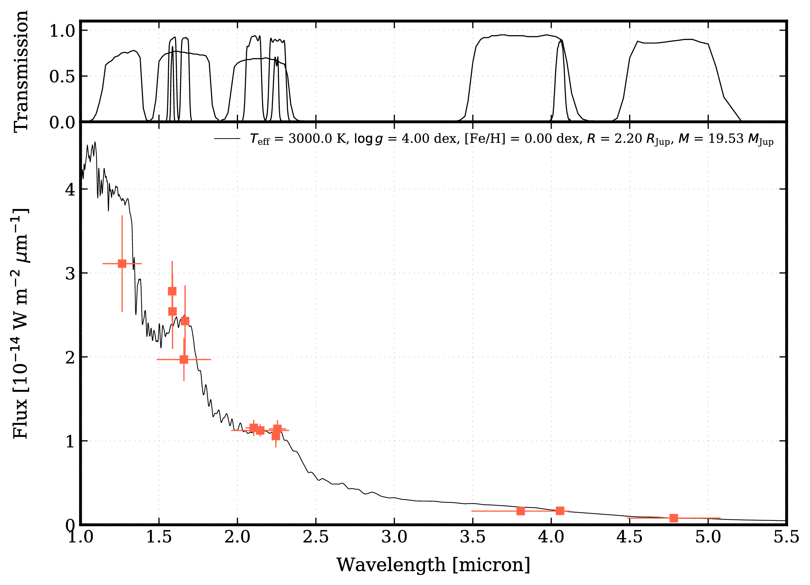

.. _running:

Running species
===============

Here you find a first example to get an impression of what a typical workflow with `species` looks like. The atmospheric model spectra will be downloaded and added to the database. The grid of spectra is then interpolated and plotted for the given parameter values, together with the photometry of PZ Tel B and the filter transmission curves. The code can be executed from the command line or within a `Jupyter notebook <https://jupyter.org/>`_.

.. code-block:: python

   import species

   # initialize species
   species.SpeciesInit('./')

   # create a database object
   database = species.Database()

   # add the AMES-Dusty atmospheric models
   database.add_model(model='ames-dusty',
                      wavelength=(0.1, 6.),
                      teff=(2500., 3500.),
                      specres=1000.)

   # add the photometry of PZ Tel B that is available in species.data.companions
   database.add_companion(name='PZ Tel B')

   # create an object for reading model spectra
   readmodel = species.ReadModel(model='ames-dusty',
                                 wavelength=(0.1, 6.0))

   # interpolate the grid of spectra
   modelbox = readmodel.get_model(model_par={'teff': 3000.,
                                             'logg': 4.0,
                                             'feh': 0.0,
                                             'radius': 2.2,
                                             'distance': 47.13},
                                  specres=100.)

   # read the photometry of PZ Tel B
   objectbox = database.get_object(object_name='PZ Tel B')

   # plot the spectrum, photometry, and filter transmission curves
   species.plot_spectrum(boxes=(modelbox, objectbox),
                         filters=objectbox.filter,
                         colors=('black', ('tomato', )),
                         offset=(-0.08, -0.07),
                         xlim=(0.2, 5.5),
                         ylim=(0., 4.8e-14),
                         legend='upper right',
                         output='spectrum.pdf')

